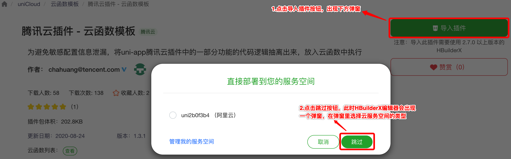

# 腾讯云机器翻译（TMT）插件

## 1. 插件介绍
| 标题      | 名称    |
| ----     | ---------------- |
| 中文名称   | 腾讯云机器翻译（TMT）插件 |
| 英文名称   | tencentcloud-plugin-tmt |
| 最新版本   | v1.0.0 (2020.12.04) |
| 适用平台   | [DCloud uni-app](https://uniapp.dcloud.net.cn) |
| 适用产品   | [腾讯云机器翻译（TMT）](https://cloud.tencent.com/product/tmt) |
| GitHub项目| [tencentcloud-uniapp-plugin-tmt](https://github.com/Tencent-Cloud-Plugins/tencentcloud-uniapp-plugin-tmt) |
| gitee项目| [tencentcloud-uniapp-plugin-tmt](https://gitee.com/Tencent-Cloud-Plugins/tencentcloud-uniapp-plugin-tmt) |
| Demo项目   | [tencentcloud-uniapp-plugin-example](https://github.com/Tencent-Cloud-Plugins/tencentcloud-uniapp-plugin-example) |
| 主创团队   | 腾讯云中小企业产品中心（SMB Product Center of Tencent Cloud） |
| 兼容平台   | H5、小程序、APP |

一款帮助开发者在uni-app项目开发中快捷使用腾讯云机器翻译（TMT）产品功能的插件。

## 2. 功能特性

- 文本翻译功能
- 批量文本翻译功能
- 语种识别

## 3. 安装指引

本插件需要调用uniCloud云函数，而使用云函数的前提是：

- 使用DCloud官方开发工具HBuilderX 2.7+；
- 已注册DCloud开发者账号并通过实名认证；
- 开通了uniCloud并创建一个腾讯云的服务空间；

### 3.1. 新建或打开已有项目

1. 打开HBuilderX开发工具；
1. 新建或打开一个uni-app项目；

### 3.2. 导入云函数

1. 访问 DCloud 插件市场的 [腾讯云插件 - 云函数模板](https://ext.dcloud.net.cn/plugin?id=2139) 详情页；
2. 点击详情页右上角 **使用 HBuilderX 导入插件**，将云函数模板导入到您的项目中；

3. 在项目中打开 _cloudfunctions/tencentcloud-plugin/config.js_ 文件，将腾讯云的密钥信息配置进去，可以在腾讯云 [API 密钥管理](https://console.cloud.tencent.com/cam/capi) 中获取 SecretId、SecretKey 和 APPID；

4. 在[uniCloud控制台](https://unicloud.dcloud.net.cn/login)注册HBuild账号并登录，创建[云服务空间](https://uniapp.dcloud.net.cn/uniCloud/concepts/space)；

5. 在项目中打开 _cloudfunctions/tencentcloud-plugin/tmt/config.js 文件，将region配置进去，具体可参考[地域列表](https://cloud.tencent.com/document/api/1073/37989#.E5.9C.B0.E5.9F.9F.E5.88.97.E8.A1.A8)；
6. 绑定云函数的云服务空间，将[云函数](https://uniapp.dcloud.net.cn/uniCloud/concepts/cloudfunction) [**上传部署**](https://uniapp.dcloud.net.cn/uniCloud/quickstart?id=rundebug) 到您的[云服务空间](https://uniapp.dcloud.net.cn/uniCloud/concepts/space)；


> 如果您之前在使用其它腾讯云产品的 uni-app 插件时已经导入过此云函数模板，则前 4 个步骤可以省略。

> 若导入失败或有其它疑问，请查看 [uniCloud帮助文档](https://uniapp.dcloud.io/uniCloud/README) 云函数相关章节。

### 3.3. 导入插件

1. 访问DCloud插件市场 [腾讯云机器翻译（TMT）插件](https://ext.dcloud.net.cn/plugin?id=3586) 详情页；
2. 点击详情页右上角 **使用HBuilderX导入插件** ，将插件导入到您的项目中；
3. 在项目中通过 import 语法将插件提供的方法导入到相关业务组件并使用；

> 本插件的默认导入位置是在您项目的“js_sdk”目录下

## 4. 使用指引

### 4.1. 插件API导图


### 4.2. 插件API列表

| API名称          | API对应方法名 |
| ---------------- | ------------- |
| 获取文本翻译结果 | getTextTranslateResult |
| 获取批量文本翻译结果 | getTextTranslateBatchResult |
| 获取语种识别结果 | getLanguageDetectResult |

### 4.3. 插件使用示例

```javascript
// 机器翻译-文本翻译使用示例
// 从js_sdk列表中导入需要的api
import { getTextTranslateResult } from "@/js_sdk/tencentcloud-plugin-tmt";

export default {
  data() {
    return {
    };
  },
  methods: {
    // 开始文本翻译
    async startTranslate() {
      const paramsData = {
        sourceText: '你好',
        source: 'zh',
        target: 'en'
      };
      const result  = await getTextTranslateResult(paramsData);
    }
  }
};
```

### 4.4 主要API 说明

#### getTextTranslateResult(params) ⇒ <code>Promise.&lt;object&gt;</code>
**Returns**: <code>Promise.&lt;object&gt;</code> - result 文本翻译结果

| Param          | Type | Required |  Description |
| ---------------- | ------------- | ---- | ---- |
| params | <code>object</code> | <code>true</code> | 文本翻译配置参数 |
| params.sourceText | <code>string</code> | <code>true</code> | 待翻译的文本，文本统一使用utf-8格式编码,html标记等非常规翻译文本可能会翻译失败。单次请求的文本长度需要低于2000 |
| params.source | <code>string</code> | <code>true</code> | 源语言 |
| params.target | <code>string</code> | <code>true</code> | 目标语言 |
| params.projectId | <code>integer</code> |  <code>false</code> | 项目ID，可以根据控制台-账号中心-项目管理中的配置填写 |
| params.untranslatedText | <code>string</code> |  <code>false</code> | 用来标记不希望被翻译的文本内容，如句子中的特殊符号、人名、地名等；每次请求只支持配置一个不被翻译的单词；仅支持配置人名、地名等名词，不要配置动词或短语，否则会影响翻译结果 |

#### getTextTranslateBatchResult(params) ⇒ <code>Promise.&lt;object&gt;</code>
**Returns**: <code>Promise.&lt;object&gt;</code> - result 批量文本翻译结果

| Param          | Type | Required |  Description |
| ---------------- | ------------- | ---- | ---- |
| params | <code>object</code> | <code>true</code> | 文本翻译配置参数 |
| params.sourceTextList | <code>[string]array</code> | <code>true</code> | 待翻译的文本列表，批量接口可以以数组方式在一次请求中填写多个待翻译文本，文本统一使用utf-8格式编码,html标记等非常规翻译文本可能会翻译失败。单次请求的文本长度需要低于2000 |
| params.source | <code>string</code> | <code>true</code> | 源语言 |
| params.target | <code>string</code> | <code>true</code> | 目标语言 |
| params.projectId | <code>integer</code> |  <code>false</code> | 项目ID，可以根据控制台-账号中心-项目管理中的配置填写 |
### 4.5. 名词解释

服务空间：一个服务空间对应一整套独立的云开发资源，包括数据库、存储空间、云函数等资源。服务空间之间彼此隔离。更多详情请访问 [uniCloud开发文档](https://uniapp.dcloud.io/uniCloud/concepts/space)

云函数：云函数是运行在云端的JavaScript代码，更多详情请见 [uniCloud云函数文档](https://uniapp.dcloud.io/uniCloud/cf-functions)

## 5. 获取入口

| 插件入口       | 链接                                                                      |
| -------------- | ------------------------------------------------------------------------- |
| DCloud插件市场 | [腾讯云机器翻译（TMT）插件](https://ext.dcloud.net.cn/plugin?id=3586) |

## 6. FAQ
> 1. Q:有没有demo示例？
>    
>    A：请查看demo示例[tencentcloud-uniapp-plugin-example](https://github.com/Tencent-Cloud-Plugins/tencentcloud-uniapp-plugin-example)


## 7. GitHub版本迭代记录

### 7.1. tencentcloud-uniapp-plugin-tmt v1.0.0

- 文本翻译功能
- 批量文本翻译功能
- 语种识别
  
## 8. 联系我们

&nbsp;&nbsp;&nbsp;扫码备注“云插件”来联络到我们</br>

